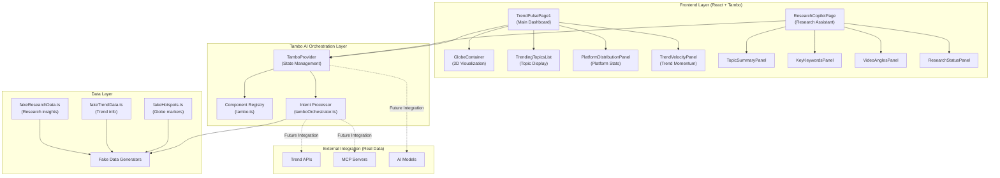
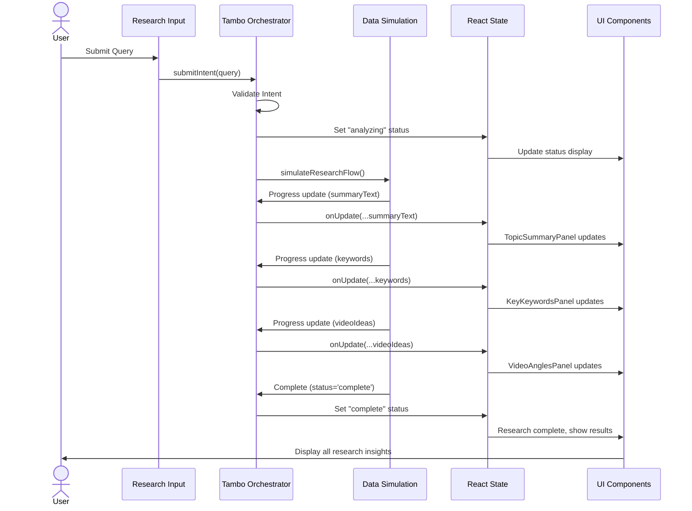
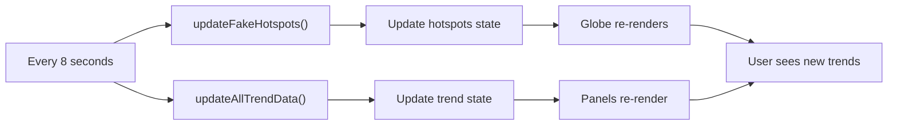
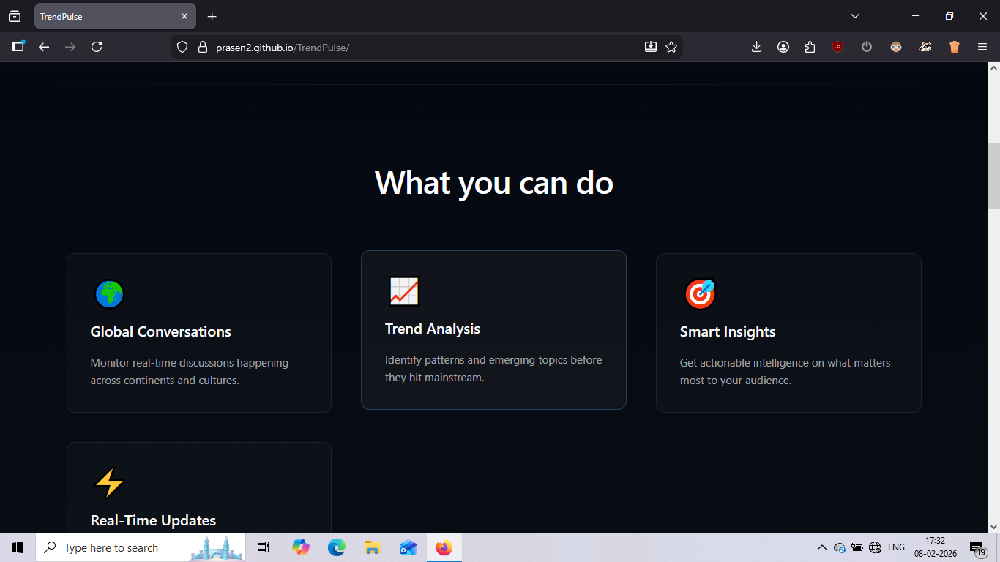
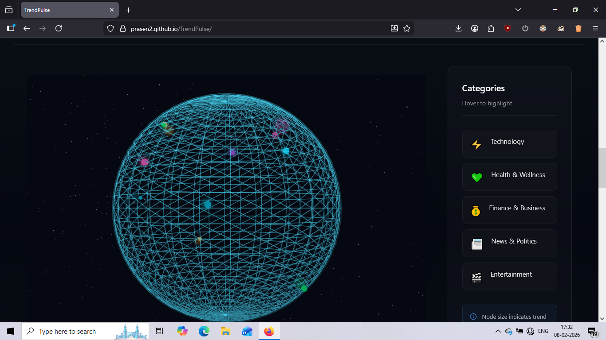

# TrendPulse 🌍📊

**Real-time trend intelligence powered by Tambo AI**

An intelligent trend analysis and research assistant that harnesses the power of Tambo's generative UI framework to deliver dynamic, data-driven insights for content creators, researchers, and business analysts.

---

## 📖 Overview

**TrendPulse** is a sophisticated web application that combines real-time trend detection with AI-powered research capabilities. Built on the **Tambo AI framework**, it provides an interactive platform for exploring global trends through an immersive 3D globe visualization and conducting deep research on trending topics.

The platform features:
- **Interactive 3D Globe**: Visualize trend hotspots across the globe in real-time
- **Trend Analysis Panels**: Monitor trending topics, platform distribution, and trend velocity
- **Research Copilot**: AI-powered research assistant that generates topic summaries, keywords, and video angles
- **Tambo-Orchestrated UI**: All components are dynamically controlled by Tambo, enabling intelligent data-driven interactions

---

## 🎯 Key Features

### 1. **Interactive 3D Globe Visualization**
   - Real-time trend hotspots displayed as color-coded markers
   - Auto-rotating globe with interactive controls
   - Geographic categorization of trends (Tech, Health, Finance, News, Entertainment)
   - Intensity-based sizing and opacity for trend significance

### 2. **Trend Intelligence Panels**
   - **Trending Topics List**: Real-time ranking of trending topics with velocity indicators
   - **Platform Distribution Chart**: Analyze discussion volume across YouTube, Twitter/X, Reddit, and News Sites
   - **Trend Velocity Meter**: Monitor acceleration/deceleration of trending topics with historical trend lines
   - **Topic Summary Panel**: AI-generated summaries of research topics

### 3. **Research Copilot**
   - **Smart Research Intent Processing**: Submit natural language queries for instant analysis
   - **Topic Summaries**: Comprehensive overviews of trending topics
   - **Keyword Extraction**: Automatically identify relevant keywords and concepts
   - **Video Angle Suggestions**: AI-generated content angle recommendations for creators
   - **Progressive Research State**: Real-time updates as analysis progresses

### 4. **Seamless Navigation**
   - Toggle between Trend Monitoring (Page 1) and Research Copilot (Page 2)
   - Responsive design optimized for desktop and tablet experiences

---

## 💡 Why TrendPulse Exists

Content creators, marketers, and researchers struggle with several challenges:

1. **Information Overload**: Tracking trends across multiple platforms is time-consuming
2. **Poor Insights**: Generic trend lists lack context and actionable intelligence
3. **Creative Block**: Finding inspiration for content angles is difficult without research support
4. **Regional Blindness**: Missing global trend patterns that could drive engagement

**TrendPulse solves these problems** by:
- Centralizing trend data from multiple sources
- Providing AI-powered context and analysis
- Suggesting ready-to-use content angles
- Visualizing trends geographically for better understanding

---

## 🤖 How Tambo Is Used (Core Section)

**Tambo AI** is the orchestration backbone of TrendPulse. Instead of traditional state management, Tambo enables **intelligent, data-driven component orchestration** where the AI framework controls what data flows to which component and how the UI responds to user intents.

### Tambo Components Architecture

```typescript
// Key Tambo Components in TrendPulse:
1. TrendPulsePage1 - Main dashboard with globe and trend panels
2. GlobeContainer - 3D visualization of trend hotspots
3. TrendingTopicsList - Ranked topic display
4. PlatformDistributionPanel - Multi-platform analysis
5. TrendVelocityPanel - Trend momentum tracking
6. ResearchCopilotPage - AI research assistant interface
7. TopicSummaryPanel - Intelligent topic briefing
8. KeyKeywordsPanel - Extracted keyword display
9. VideoAnglesPanel - Content angle suggestions
10. ResearchStatusPanel - Real-time research progress
```

### Tambo-Orchestrated Data Flow

**Key Principle**: Components never fetch, calculate, or transform data. Tambo provides all data and logic.


### Tambo's Role in TrendPulse

| Responsibility | How Tambo Implements It |
|---|---|
| **Data Orchestration** | Manages all state updates and data flow across components |
| **Intent Processing** | Receives research queries and orchestrates multi-step analysis |
| **Component Updates** | Reactively updates all dependent components when data changes |
| **Intelligent Routing** | Determines data transformations and component sequences |
| **Real-time Sync** | Ensures all panels update consistently across the application |

### Research Intent Processing with Tambo

When a user submits a research query:

1. **Intent Submission**: User query is captured as a `ResearchIntent`
2. **Tambo Orchestration**: Intent flows to `submitIntent()` function
3. **Progressive State Updates**: Tambo orchestrates real-time updates through `onUpdate` callbacks
4. **Component Synchronization**: All research panels update automatically with new insights


---

## 🏗️ Architecture

### System Architecture Diagram



---

## 📡 Data Flow (Intent → UI)

### Complete Data Flow Diagram



### Data Update Cycle (Page 1 - Trends)



---

## 🛠️ Tech Stack

### Frontend Framework
- **React 18.2** - UI component library with hooks
- **TypeScript 5.2** - Type-safe JavaScript development
- **Vite 7.3** - Lightning-fast build tool and dev server

### Tambo AI Integration
- **@tambo-ai/react** - Tambo AI framework for React
- **Zod 3.22** - TypeScript-first schema validation

### 3D Visualization
- **react-globe.gl 2.27** - Interactive 3D globe rendering
- **Three.js 0.160** - WebGL 3D graphics

### Routing & Navigation
- **react-router-dom 7.13** - Client-side routing

### Styling
- **CSS3** - Custom styling with Flexbox and Grid
- **Responsive Design** - Mobile-first approach

### Development Tools
- **TypeScript Compiler** - Static type checking
- **ESLint** - Code linting
- **Vite Dev Server** - Hot module replacement

### Deployment
- **GitHub Pages** - Static hosting via gh-pages
- **Build Pipeline** - TypeScript compilation → Vite bundling

---

## 📸 Screenshots & Demo

### Page 1: Trend Monitoring Dashboard





### Page 2: Research Copilot


### Live Demo
- **Homepage**: [https://Prasen2.github.io/TrendPulse/](https://Prasen2.github.io/TrendPulse/)
- Experience real-time trend visualization and AI-powered research

---

## 📚 Learning & Growth

### What We Learned

#### 1. **Tambo AI Framework Mastery** 🤖
   - **Generative UI Paradigm**: Learned how Tambo enables data-driven, AI-orchestrated UI
   - **Component Registration**: Mastered registering components with Zod schemas for type-safe prop validation
   - **Intent Processing**: Understood how to architect user intents as structured data for AI processing
   - **Progressive Updates**: Learned to implement progressive, real-time state updates through callbacks
   - **Orchestration Pattern**: Appreciated the power of letting AI control data flow and component updates

#### 2. **3D Web Development** 🌐
   - **Three.js Integration**: Learned WebGL basics for 3D graphics rendering
   - **Globe Visualization**: Built interactive 3D globe with latitude/longitude positioning
   - **Interactive Controls**: Implemented auto-rotation, manual drag controls, and reactive updates
   - **Performance Optimization**: Managed 100+ moving elements without frame drops

#### 3. **Full-Stack Deployment** 🚀
   - **Build Optimization**: Mastered Vite for fast development and optimized production builds
   - **GitHub Pages Deployment**: Learned static site hosting and CI/CD pipeline setup
   - **TypeScript Compilation**: Configured build pipeline for strict type checking
   - **Environment Management**: Implemented environment variable handling for API keys and secrets

#### 4. **Generative UI Thinking** 🧠
   - **Data-First Architecture**: Shifted from imperative to declarative, data-driven UI patterns
   - **AI as Orchestrator**: Experienced AI controlling application flow rather than executing simple tasks
   - **Component Composability**: Learned how composable components enable AI-driven composition
   - **Intent-Based Design**: Built applications around structured user intents instead of direct actions

---

## Future External API Integrations

1. **Trend Detection APIs**
   - Google Trends API for search interest data
   - Twitter/X API v2 for social conversations
   - YouTube Data API for video engagement metrics
   - Reddit API for community discussions

2. **NLP & AI Services**
   - OpenAI GPT API for intelligent summarization
   - Anthropic Claude for research context
   - Real-time language processing for keyword extraction

3. **News & Content APIs**
   - NewsAPI for aggregated news sources
   - MediaStack for global news coverage
   - Webhose.io for alternative media sources

4. **Analytics Platforms**
   - Google Analytics for website trends
   - Similar Web for competitor trend tracking
   - Chartbeat for real-time content analytics

---

## 🎯 Real Data Integration Strategy

### Current State: Simulated Data
TrendPulse currently uses **fake data generation** to demonstrate architecture:

```typescript
// Fake data sources
├── fakeHotspots.ts         // Simulated globe markers
├── fakeTrendData.ts         // Simulated trend metrics
└── fakeResearchData.ts      // Simulated research results
```

### Real Data Benefits
- ✅ **Live Trends**: Real-time trend data from multiple sources
- ✅ **AI Intelligence**: Actual AI-powered summarization and insights
- ✅ **Creator Value**: Actionable, data-backed recommendations
- ✅ **Scalability**: Support for monitoring thousands of concurrent trends

---

## 🚀 Getting Started

### Prerequisites
- Node.js 16+ and npm/yarn
- Modern browser with WebGL support
- Tambo AI API key (get one at [console.tambo.co](https://console.tambo.co))

### Installation

```bash
# Clone the repository
git clone https://github.com/Prasen2/TrendPulse.git
cd TrendPulse

# Install dependencies
npm install

# Set up environment variables
echo 'VITE_TAMBO_API_KEY=your_api_key_here' > .env.local
```

### Development

```bash
# Start development server
npm run dev

# Open http://localhost:5173 in your browser
# Vite will automatically reload on file changes

# Run type checking
npx tsc --noEmit
```

### Production Build

```bash
# Build optimized bundle
npm run build

# Preview production build locally
npm run preview

# Deploy to GitHub Pages
npm run deploy
```

---

## 🤝 Contributing

We welcome contributions! Please follow these guidelines:

1. **Fork** the repository
2. **Create** a feature branch (`git checkout -b feature/YourFeature`)
3. **Commit** your changes (`git commit -m 'Add YourFeature'`)
4. **Push** to the branch (`git push origin feature/YourFeature`)
5. **Open** a Pull Request

---


## 📞 Support & Contact

- **Issues**: Report bugs and feature requests on [GitHub Issues](https://github.com/Prasen2/TrendPulse/issues)
- **Tambo Docs**: [https://docs.tambo.co](https://docs.tambo.co)
- **Tambo Community**: [https://discord.gg/tambo](https://discord.gg/tambo)

---

## 🙏 Acknowledgments

- **Tambo AI** for the revolutionary generative UI framework
- **Three.js** community for excellent 3D graphics tools
- **React Team** for the powerful UI library
- All contributors and users who have provided feedback

---

**Built with ❤️ using Tambo AI | [TrendPulse Live](https://Prasen2.github.io/TrendPulse/)**
