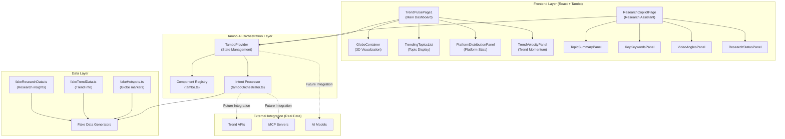
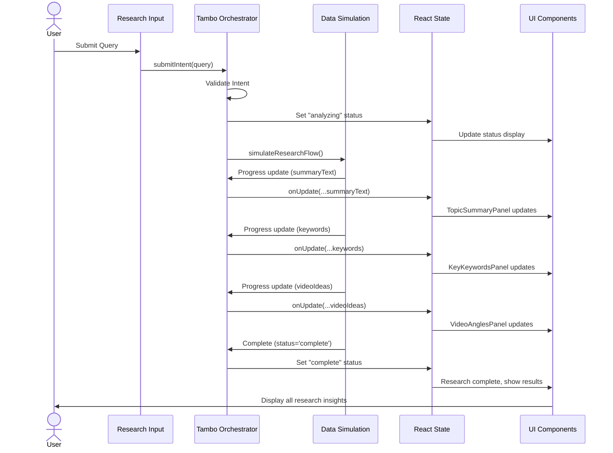
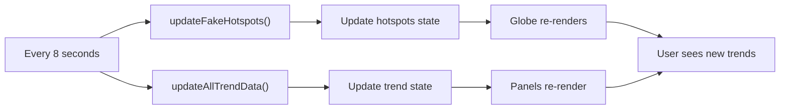
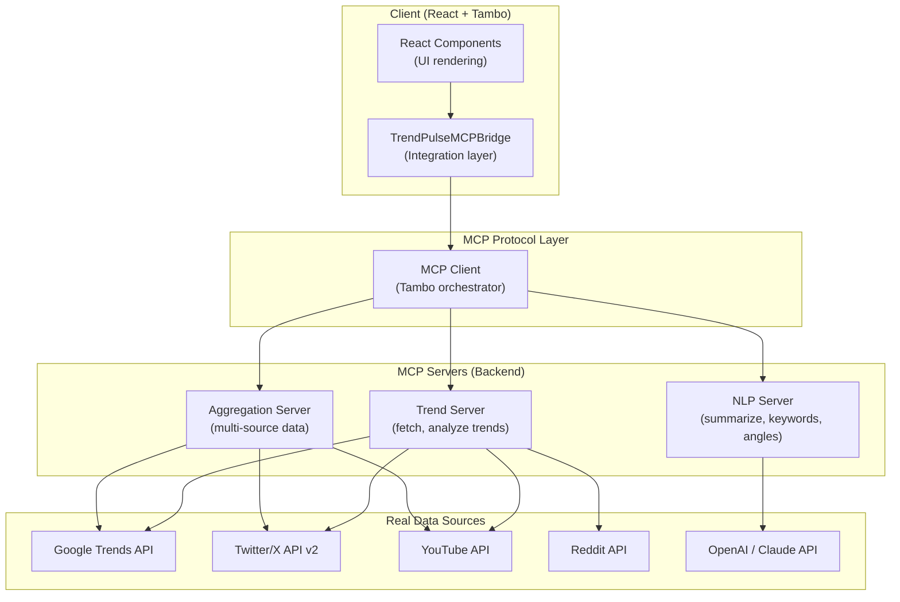

# TrendPulse 🌍📊

**Real-time trend intelligence powered by Tambo AI**

An intelligent trend analysis and research assistant that harnesses the power of Tambo's generative UI framework to deliver dynamic, data-driven insights for content creators, researchers, and business analysts.

---

## 📖 Overview

**TrendPulse** is a sophisticated web application that combines real-time trend detection with AI-powered research capabilities. Built on the **Tambo AI framework**, it provides an interactive platform for exploring global trends through an immersive 3D globe visualization and conducting deep research on trending topics.

The platform features:
- **Interactive 3D Globe**: Visualize trend hotspots across the globe in real-time
- **Trend Analysis Panels**: Monitor trending topics, platform distribution, and trend velocity
- **Research Copilot**: AI-powered research assistant that generates topic summaries, keywords, and video angles
- **Tambo-Orchestrated UI**: All components are dynamically controlled by Tambo, enabling intelligent data-driven interactions

---

## 🎯 Key Features

### 1. **Interactive 3D Globe Visualization**
   - Real-time trend hotspots displayed as color-coded markers
   - Auto-rotating globe with interactive controls
   - Geographic categorization of trends (Tech, Health, Finance, News, Entertainment)
   - Intensity-based sizing and opacity for trend significance

### 2. **Trend Intelligence Panels**
   - **Trending Topics List**: Real-time ranking of trending topics with velocity indicators
   - **Platform Distribution Chart**: Analyze discussion volume across YouTube, Twitter/X, Reddit, and News Sites
   - **Trend Velocity Meter**: Monitor acceleration/deceleration of trending topics with historical trend lines
   - **Topic Summary Panel**: AI-generated summaries of research topics

### 3. **Research Copilot**
   - **Smart Research Intent Processing**: Submit natural language queries for instant analysis
   - **Topic Summaries**: Comprehensive overviews of trending topics
   - **Keyword Extraction**: Automatically identify relevant keywords and concepts
   - **Video Angle Suggestions**: AI-generated content angle recommendations for creators
   - **Progressive Research State**: Real-time updates as analysis progresses

### 4. **Seamless Navigation**
   - Toggle between Trend Monitoring (Page 1) and Research Copilot (Page 2)
   - Responsive design optimized for desktop and tablet experiences

---

## 💡 Why TrendPulse Exists

Content creators, marketers, and researchers struggle with several challenges:

1. **Information Overload**: Tracking trends across multiple platforms is time-consuming
2. **Poor Insights**: Generic trend lists lack context and actionable intelligence
3. **Creative Block**: Finding inspiration for content angles is difficult without research support
4. **Regional Blindness**: Missing global trend patterns that could drive engagement

**TrendPulse solves these problems** by:
- Centralizing trend data from multiple sources
- Providing AI-powered context and analysis
- Suggesting ready-to-use content angles
- Visualizing trends geographically for better understanding

---

## 🤖 How Tambo Is Used (Core Section)

**Tambo AI** is the orchestration backbone of TrendPulse. Instead of traditional state management, Tambo enables **intelligent, data-driven component orchestration** where the AI framework controls what data flows to which component and how the UI responds to user intents.

### Tambo Components Architecture

```typescript
// Key Tambo Components in TrendPulse:
1. TrendPulsePage1 - Main dashboard with globe and trend panels
2. GlobeContainer - 3D visualization of trend hotspots
3. TrendingTopicsList - Ranked topic display
4. PlatformDistributionPanel - Multi-platform analysis
5. TrendVelocityPanel - Trend momentum tracking
6. ResearchCopilotPage - AI research assistant interface
7. TopicSummaryPanel - Intelligent topic briefing
8. KeyKeywordsPanel - Extracted keyword display
9. VideoAnglesPanel - Content angle suggestions
10. ResearchStatusPanel - Real-time research progress
```

### Tambo-Orchestrated Data Flow

**Key Principle**: Components never fetch, calculate, or transform data. Tambo provides all data and logic.

```typescript
// Example: TrendingTopicsList Component
export function TrendingTopicsList({ topics }: TrendingTopicsListProps) {
  // ✅ Simply renders provided data
  // ❌ NEVER sorts, filters, or fetches
  return (
    <div className="topics-list">
      {topics.map(topic => (
        <div key={topic.id} className="topic-item">
          <span className={`category-badge cat-${topic.category}`}>
            {topic.category}
          </span>
          <span className="topic-name">{topic.name}</span>
          <span className="topic-score">{topic.score}</span>
          <span className={`velocity vel-${topic.velocity}`}>
            {topic.velocity}
          </span>
        </div>
      ))}
    </div>
  );
}
```


### Tambo's Role in TrendPulse

| Responsibility | How Tambo Implements It |
|---|---|
| **Data Orchestration** | Manages all state updates and data flow across components |
| **Intent Processing** | Receives research queries and orchestrates multi-step analysis |
| **Component Updates** | Reactively updates all dependent components when data changes |
| **Intelligent Routing** | Determines data transformations and component sequences |
| **Real-time Sync** | Ensures all panels update consistently across the application |

### Research Intent Processing with Tambo

When a user submits a research query:

1. **Intent Submission**: User query is captured as a `ResearchIntent`
2. **Tambo Orchestration**: Intent flows to `submitIntent()` function
3. **Progressive State Updates**: Tambo orchestrates real-time updates through `onUpdate` callbacks
4. **Component Synchronization**: All research panels update automatically with new insights

```typescript
// Research Flow Example
const handleResearchSubmit = async (query: string) => {
  const intent: ResearchIntent = {
    type: 'research_request',
    query: query,
  };
  
  // Tambo orchestrates the entire flow
  await submitIntent(intent, (state) => {
    setResearchState(prev => ({ ...prev, ...state }));
  });
}
```


---

## 🏗️ Architecture

### System Architecture Diagram



---

## 📡 Data Flow (Intent → UI)

### Complete Data Flow Diagram



### Data Update Cycle (Page 1 - Trends)



---

## 🛠️ Tech Stack

### Frontend Framework
- **React 18.2** - UI component library with hooks
- **TypeScript 5.2** - Type-safe JavaScript development
- **Vite 7.3** - Lightning-fast build tool and dev server

### Tambo AI Integration
- **@tambo-ai/react** - Tambo AI framework for React
- **Zod 3.22** - TypeScript-first schema validation

### 3D Visualization
- **react-globe.gl 2.27** - Interactive 3D globe rendering
- **Three.js 0.160** - WebGL 3D graphics

### Routing & Navigation
- **react-router-dom 7.13** - Client-side routing

### Styling
- **CSS3** - Custom styling with Flexbox and Grid
- **Responsive Design** - Mobile-first approach

### Development Tools
- **TypeScript Compiler** - Static type checking
- **ESLint** - Code linting
- **Vite Dev Server** - Hot module replacement

### Deployment
- **GitHub Pages** - Static hosting via gh-pages
- **Build Pipeline** - TypeScript compilation → Vite bundling

---

## 📸 Screenshots & Demo

### Page 1: Trend Monitoring Dashboard
- Interactive 3D globe with trend hotspots visualization
- Real-time trending topics with category badges and velocity indicators
- Platform distribution analysis across YouTube, Twitter/X, Reddit, and News
- Trend velocity meter showing acceleration/deceleration metrics

### Page 2: Research Copilot
- Intelligent research input panel for natural language queries
- AI-generated topic summaries with key insights
- Extracted keywords and related concepts
- Video angle suggestions for content creators
- Real-time research status tracking

### Live Demo
- **Homepage**: [https://Prasen2.github.io/TrendPulse/](https://Prasen2.github.io/TrendPulse/)
- Experience real-time trend visualization and AI-powered research

---

## 📚 Learning & Growth

### What We Learned

#### 1. **Tambo AI Framework Mastery** 🤖
   - **Generative UI Paradigm**: Learned how Tambo enables data-driven, AI-orchestrated UI
   - **Component Registration**: Mastered registering components with Zod schemas for type-safe prop validation
   - **Intent Processing**: Understood how to architect user intents as structured data for AI processing
   - **Progressive Updates**: Learned to implement progressive, real-time state updates through callbacks
   - **Orchestration Pattern**: Appreciated the power of letting AI control data flow and component updates

#### 2. **React & TypeScript Expertise** ⚛️
   - **Hooks Mastery**: Extensive use of `useState`, `useEffect`, `useContext` for state management
   - **Type Safety**: Comprehensive TypeScript typing with Zod schema validation
   - **Component Architecture**: Designed clean, reusable components with clear separation of concerns
   - **Routing**: Implemented multi-page navigation with `react-router-dom`
   - **Performance**: Optimized re-renders and state updates for smooth interactions

#### 3. **3D Web Development** 🌐
   - **Three.js Integration**: Learned WebGL basics for 3D graphics rendering
   - **Globe Visualization**: Built interactive 3D globe with latitude/longitude positioning
   - **Interactive Controls**: Implemented auto-rotation, manual drag controls, and reactive updates
   - **Performance Optimization**: Managed 100+ moving elements without frame drops

#### 4. **Full-Stack Deployment** 🚀
   - **Build Optimization**: Mastered Vite for fast development and optimized production builds
   - **GitHub Pages Deployment**: Learned static site hosting and CI/CD pipeline setup
   - **TypeScript Compilation**: Configured build pipeline for strict type checking
   - **Environment Management**: Implemented environment variable handling for API keys and secrets

#### 5. **Generative UI Thinking** 🧠
   - **Data-First Architecture**: Shifted from imperative to declarative, data-driven UI patterns
   - **AI as Orchestrator**: Experienced AI controlling application flow rather than executing simple tasks
   - **Component Composability**: Learned how composable components enable AI-driven composition
   - **Intent-Based Design**: Built applications around structured user intents instead of direct actions

---

## 🔮 Future: MCP Integration with TrendPulse

### Why We're Adding MCP

The **Model Context Protocol (MCP)** is the missing piece that will transform TrendPulse from a demo with simulated data into a **production-ready platform** with real-time intelligence:

#### Problems MCP Solves

1. **Data Source Abstraction**
   - Current: Hard-coded fake data in `fakeHotspots.ts`, `fakeTrendData.ts`
   - With MCP: Seamlessly switch between mock data, APIs, databases, and LLM-powered services
   - **Benefit**: Single unified interface for all data sources

2. **Decoupled Backend Services**
   - Current: All logic lives in frontend React components
   - With MCP: Separate backend services for trend detection, NLP analysis, and data aggregation
   - **Benefit**: Scalable microservices architecture without rewriting frontend

3. **Real-Time Intelligence Automation**
   - Current: Tambo manages UI orchestration only
   - With MCP: Tambo + MCP servers work together for intelligent data generation
   - **Benefit**: AI-powered servers handle complex analysis while React handles UI

4. **Tool-Based Extensibility**
   - Current: Adding new data source requires code changes and redeployment
   - With MCP: Add new tools/servers without touching the frontend
   - **Benefit**: Plugins and extensions for trend detection, keyword extraction, etc.

5. **Standard Integration Pattern**
   - Current: Custom adapters for each API (if we add them)
   - With MCP: Standard protocol for all integrations
   - **Benefit**: Built-in tooling, debugging, and community support

### How We'll Integrate MCP

#### Phase 1: MCP Server Infrastructure

```typescript
// Backend: MCP Servers for TrendPulse

// 1. Trend Detection Server
interface TrendMCPServer {
  tools: {
    "fetch_trending_topics": (
      region: string,
      category: string
    ) => Promise<Hotspot[]>
    
    "analyze_trend_velocity": (
      topicId: string,
      timeRange: string
    ) => Promise<VelocityMetrics>
    
    "get_platform_distribution": (
      topic: string
    ) => Promise<PlatformStats>
  }
}

// 2. NLP & Research Server
interface NLPMCPServer {
  tools: {
    "summarize_topic": (topic: string) => Promise<string>
    "extract_keywords": (content: string) => Promise<string[]>
    "generate_video_angles": (topic: string) => Promise<VideoAngle[]>
  }
}

// 3. Data Aggregation Server
interface AggregationMCPServer {
  tools: {
    "fetch_multi_source_trends": () => Promise<AggregatedTrends>
    "sync_real_time_data": (source: string) => Promise<UpdatedTrends>
  }
}
```

#### Phase 2: Frontend Integration Layer

```typescript
// Frontend: tamboOrchestrator.ts adapts to use MCP

import { ManagedResource } from '@modelcontextprotocol/sdk/client/index.d.ts';

export class TrendPulseMCPBridge {
  private mcpClient: ManagedResource;
  private trendServer: TrendMCPServer;
  private nlpServer: NLPMCPServer;
  
  async initializeMCP() {
    // Connect to MCP servers
    this.trendServer = await this.connectToMCPServer('trend-detection');
    this.nlpServer = await this.connectToMCPServer('nlp-processing');
  }
  
  async submitIntent(intent: ResearchIntent, onUpdate: UpdateCallback) {
    // Step 1: Use Trend Server to get current data
    const trendContext = await this.trendServer.tools.fetch_trending_topics(
      intent.region || 'global',
      'all'
    );
    
    // Step 2: Use NLP Server for analysis
    const summary = await this.nlpServer.tools.summarize_topic(intent.query);
    const keywords = await this.nlpServer.tools.extract_keywords(summary);
    const angles = await this.nlpServer.tools.generate_video_angles(intent.query);
    
    // Step 3: Progressive updates through Tambo
    onUpdate({ summaryText: summary });
    onUpdate({ keywords });
    onUpdate({ videoIdeas: angles });
    onUpdate({ researchStatus: 'complete' });
  }
}
```

#### Phase 3: Gradual Data Source Migration

```typescript
// Migration Path: Fake Data → MCP Servers

// TODAY: Simulated data
const trendData = fakeTrendData(); // Returns fake data

// PHASE 1: Adapter pattern
const trendData = await mcpBridge.fetchTrendData(); // Uses MCP or falls back to fake

// PHASE 2: Real APIs
const trendData = await mcpBridge.fetchTrendData();
// ↓ Uses MCP servers
// ├── Google Trends API
// ├── Twitter/X API v2
// ├── YouTube Data API
// └── Reddit API

// PHASE 3: AI-Powered Generation
const trendData = await mcpBridge.fetchTrendData();
// ↓ MCP servers powered by LLMs
// ├── Multi-source trend synthesis
// ├── Pattern detection AI
// └── Predictive trend analysis
```

### MCP Architecture in TrendPulse



### Benefits We'll Gain

| Before MCP | After MCP |
|---|---|
| Fake data + demo only | Real-time professional platform |
| Frontend handles all logic | Clean separation of concerns |
| Hard to scale | Production-ready microservices |
| Tightly coupled to one data source | Flexible, pluggable architecture |
| Limited AI capabilities | Full LLM-powered intelligence |
| Manual API integration work | Standard protocol, automatic tooling |

### Timeline

- **Phase 1 (Feb)**: Set up MCP servers infrastructure with basic trend fetching
- **Phase 2 (Mar)**: Integrate MCP bridge into Tambo orchestrator
- **Phase 3 (Apr)**: Connect real APIs (Google Trends, Twitter/X, YouTube)
- **Phase 4 (May)**: Add LLM-powered NLP servers for advanced analysis
- **Phase 5 (Jun)**: Full production deployment with real data

---

## 🔌 Real API Integrations (Powered by MCP)

Once MCP servers are operational, TrendPulse will connect to:

### Trend Detection APIs
- **Google Trends API** - Search interest data and trending searches
- **Twitter/X API v2** - Real-time social conversations and engagement
- **YouTube Data API** - Video trends and view metrics
- **Reddit API** - Community discussions and upvotes

### AI & NLP Services
- **OpenAI GPT-4** - Topic summarization and analysis
- **Anthropic Claude** - Deep research context generation
- **Hugging Face Models** - Real-time keyword extraction

### News & Content Aggregation
- **NewsAPI** - Aggregated news from 40,000+ sources
- **MediaStack** - Global news coverage and historical data
- **Webhose.io** - Alternative media and blog sources

### Analytics Platforms
- **Google Analytics API** - Website trend tracking
- **SimilarWeb** - Competitor trend intelligence
- **Chartbeat** - Real-time news analytics

---

## 📊 Current State: Simulated Data

TrendPulse currently uses **fake data generation** to demonstrate the architecture and validate the Tambo AI orchestration pattern:

```typescript
// Current fake data sources
├── fakeHotspots.ts         // Simulated globe markers
├── fakeTrendData.ts         // Simulated trend metrics
└── fakeResearchData.ts      // Simulated research results
```

This foundation enables:
- ✅ **Architecture Validation**: Proves the Tambo orchestration pattern works
- ✅ **UI/UX Development**: Allows rapid iteration on components
- ✅ **Performance Testing**: Tests 100+ concurrent updates without API limits
- ✅ **MCP Planning**: Clear data contracts for future backend services

---

## 🚀 Getting Started

### Prerequisites
- Node.js 16+ and npm/yarn
- Modern browser with WebGL support
- Tambo AI API key (get one at [console.tambo.co](https://console.tambo.co))

### Installation

```bash
# Clone the repository
git clone https://github.com/Prasen2/TrendPulse.git
cd TrendPulse

# Install dependencies
npm install

# Set up environment variables
echo 'VITE_TAMBO_API_KEY=your_api_key_here' > .env.local
```

### Development

```bash
# Start development server
npm run dev

# Open http://localhost:5173 in your browser
# Vite will automatically reload on file changes

# Run type checking
npx tsc --noEmit
```

### Production Build

```bash
# Build optimized bundle
npm run build

# Preview production build locally
npm run preview

# Deploy to GitHub Pages
npm run deploy
```

---

## 🤝 Contributing

We welcome contributions! Please follow these guidelines:

1. **Fork** the repository
2. **Create** a feature branch (`git checkout -b feature/YourFeature`)
3. **Commit** your changes (`git commit -m 'Add YourFeature'`)
4. **Push** to the branch (`git push origin feature/YourFeature`)
5. **Open** a Pull Request

---


## 📞 Support & Contact

- **Issues**: Report bugs and feature requests on [GitHub Issues](https://github.com/Prasen2/TrendPulse/issues)
- **Tambo Docs**: [https://docs.tambo.co](https://docs.tambo.co)
- **Tambo Community**: [https://discord.gg/tambo](https://discord.gg/tambo)

---

## 🙏 Acknowledgments

- **Tambo AI** for the revolutionary generative UI framework
- **Three.js** community for excellent 3D graphics tools
- **React Team** for the powerful UI library
- All contributors and users who have provided feedback

---

**Built with ❤️ using Tambo AI | [TrendPulse Live](https://Prasen2.github.io/TrendPulse/)**
